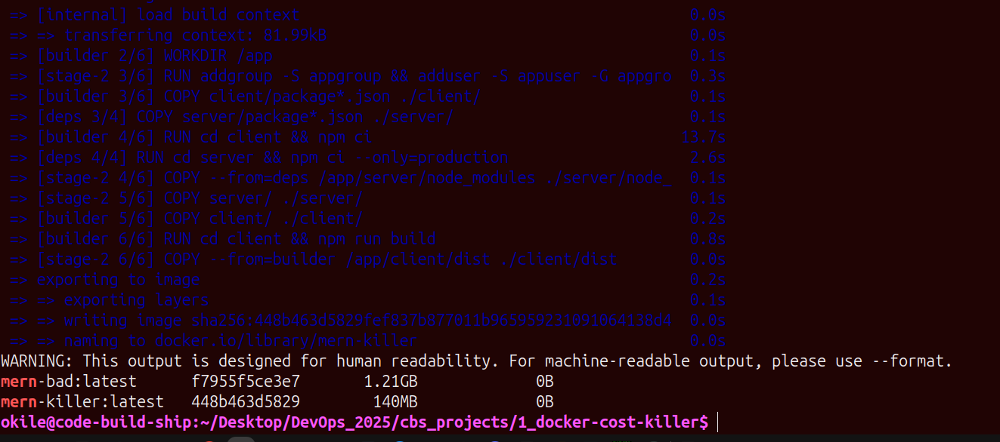

# Docker Cost Killer — Build #01 of Code Build Ship

Most MERN Docker images are 1.2GB+ because beginners copy everything.

I cut it by 88%.

## Result

| Image | Size | How |
|-------|------|-----|
| `mern-bad` (node:20) | **1.21GB** | `COPY . .` + full node + dev deps + runs as root |
| `mern-killer` (multi-stage + alpine) | **140MB** | only prod deps + dist + non-root |

**Proof:**

