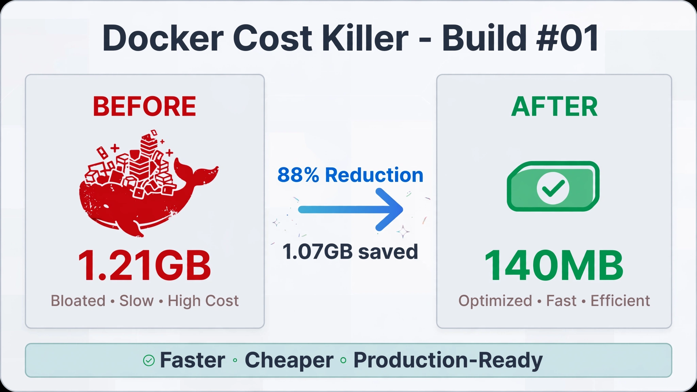

# Docker Cost Killer — Build #01 of Code Build Ship


# Docker Cost Killer - Build #01

Live URL: https://ebosterix-cost-killer.fly.dev

<picture>
  <source media="(prefers-color-scheme: dark)" srcset="./assets/banner-dark.png">
  <source media="(prefers-color-scheme: light)" srcset="./assets/banner-light.png">
  
</picture>

Most MERN Docker images ship at 1.2GB+. 
Here, I show you how to signifcantly reduce that image size to just 140MB and make it load faster and reduce your hosting costs. It's just one of those simple but very important steps one can do to reduce costs.

The reason is that it's not because developers do it wrong. It's because that's how it's built by default. Full base image, dev dependencies, and build files all get packed into production.
The developer should therefore be mindfull of cost-effective strategies in the process of development. 

I built this project to show why that matters. The heavier the image, the slower the load and the more it costs.

A 1.2GB image is slower to build, slower to deploy, and more expensive to host.

I got it down from 1.21GB to 140MB.

### Tech Stack
- Node.js + Express
- Docker Multi-Stage Build
- Fly.io - Live url [https://ebosterix-cost-killer.fly.dev/]

### The Build Logic
**Stage 1 (Builder):** Install all dependencies and build the app.

**Stage 2 (Production):** Copy only the production build to node:20-alpine. No dev tools, no source bloat.

```dockerfile
# Builder stage
FROM node:20 AS builder
WORKDIR /app
COPY package*.json ./
RUN npm install
COPY . .
RUN npm run build

# Production stage - only 140MB
FROM node:20-alpine
WORKDIR /app
COPY --from=builder /app/dist ./dist
COPY --from=builder /app/node_modules ./node_modules
EXPOSE 5000
CMD ["node", "dist/index.js"]

Result:
BEFORE: 1.21GB
AFTER: 140MB
Saved: 1.07GB (88% reduction)

Run locally:
docker build -t cost-killer .
docker run -p 5000:5000 cost-killer